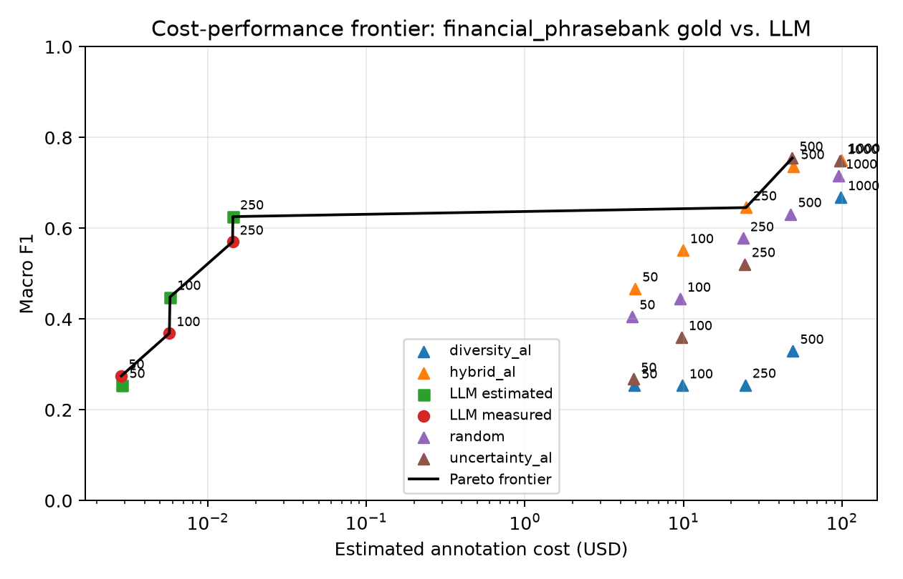

# How Many Labels Do You Actually Need?

If a team only has budget to label 250 examples, what should it do? Pick examples at random, use
active learning, ask an LLM to label them, or keep labeling until the budget runs out?

AnnotateBench turns that planning choice into a benchmark question: given a fixed label budget,
which annotation strategy produces the best downstream classifier, and where does the
cost-performance frontier change?

## Expanded Benchmark Update

AnnotateBench now includes four additional analyses for annotation-budget decisions in large data
pipelines, where the practical bottleneck is often not access to unlabeled data but deciding which
examples to label, how to value those labels, and how to account for annotation quality and cost:

- A direct positioning comparison with DataPerf, DataComp, and OpenDataVal clarifies that
  AnnotateBench jointly evaluates label acquisition, human and LLM annotation sources, downstream
  utility, monetary cost, Pareto efficiency, and reproducibility.
- A five-seed sentence-embedding sensitivity study finds that the best strategy agrees with the
  TF-IDF benchmark on 5 of 10 datasets. Strategy rankings therefore depend partly on the downstream
  representation, not only on the dataset and label budget.
- A nested acquisition study on Financial PhraseBank, TREC, and Yelp Polarity compares fresh
  fixed-budget decisions with deployed cumulative trajectories. The winning strategy agrees in 11
  of 15 dataset-budget comparisons, showing why the two protocols should not be described as the
  same experiment.
- An AG News volume study expands the candidate pool from 1,200 to 10,000 examples at a fixed
  100-label budget. Selection remains practical in this measured range, but diversity and hybrid
  selection grow more quickly than random or uncertainty selection. These timings are
  implementation- and machine-specific rather than distributed-systems throughput claims.

The revised paired analysis also supports a more conservative interpretation of strategy wins.
Across datasets, the top-two mean macro-F1 gaps range from 0.0008 to 0.0410. None of the ten exact
five-seed sign-flip comparisons remains significant after Holm correction, so the evidence supports
dataset-specific practical differences rather than a statistically resolved universal winner.

The public result files and scripts used for these analyses are in `results/` and `scripts/`;
third-party source-dataset text and raw API responses are deliberately excluded from public release
packages.

## Key Takeaways

- No annotation strategy wins across every dataset.
- Across the ten datasets, hybrid selection ranks first on five, random and uncertainty on two
  each, and diversity on one; several leading confidence intervals overlap.
- LLM-generated labels can be useful, but high label accuracy does not always translate into the
  same downstream classifier performance as gold labels.
- Cost frontiers are more useful than raw accuracy when the real decision is how to spend a
  labeling budget.
- This release is a text-classification annotation-strategy benchmark, not the full multi-task LLM
  annotation reliability benchmark described in `DESIGN_DOC.md`.

## The Problem

Annotation strategy is often chosen before a team has much evidence. Random sampling is simple.
Uncertainty sampling sounds efficient. Diversity sampling can avoid labeling the same kind of
example repeatedly. LLM labels are tempting because they are fast and cheap to request.

The hard part is that "best" depends on the dataset, the model family, the budget, and the cost
assumptions. A strategy that looks good at 50 labels may not be the best use of 500 labels. A
strategy that works for binary sentiment may not work for a many-class intent dataset.

AnnotateBench is built around that practical question: before spending the full annotation budget,
can we estimate which strategy is likely to buy the most downstream performance?

## What AnnotateBench Measures

The main benchmark uses ten public text-classification datasets: Financial PhraseBank, TREC,
Banking77, AG News, SST-2, 20 Newsgroups, Rotten Tomatoes, Yelp Polarity, TweetEval Sentiment, and
Emotion. For each dataset, AnnotateBench simulates annotation by revealing existing gold labels at
budgets 50, 100, 250, 500, and 1000.

The primary grid compares four strategies: random sampling, uncertainty active learning, diversity
active learning, and a hybrid active-learning strategy. Each condition trains the same TF-IDF +
logistic-regression classifier and records macro F1, accuracy, and cost estimates. The full
gold-label grid contains 3,000 measured rows: ten datasets, four strategies, five budgets, five
seeds, and three human-cost scenarios.

The headline result is not that one strategy always wins. Strategy choice is dataset-dependent.
Financial PhraseBank and SST-2 favor uncertainty sampling; AG News, Emotion, TREC, TweetEval
Sentiment, and Yelp Polarity favor the hybrid strategy; Banking77 and 20 Newsgroups favor random
sampling; and Rotten Tomatoes favors diversity sampling under the primary TF-IDF setup. Several
top-two confidence intervals overlap, so small differences should not be read as decisive wins.

That variation is the point: annotation plans should be evaluated against the dataset, budget,
model family, and cost assumptions instead of chosen by habit.

## What the LLM Extension Shows

AnnotateBench also includes a seed-0/1/2 LLM annotator extension. For all ten datasets,
`gpt-4o-mini` labels randomly selected training examples at budgets 50, 100, and 250. The benchmark
then trains the same downstream classifier on those model-generated labels and evaluates on the
gold test set.

At budget 250, averaged across the three seeds, LLM label quality and downstream utility are
related but not interchangeable. Yelp Polarity is the strongest case: the LLM-trained classifier
reaches 0.675 macro F1, roughly matching the best gold-label strategy at 0.672, with 0.972 label
accuracy on the selected examples. Financial PhraseBank is close to the gold-label strategy, with
0.589 versus 0.634 macro F1. Other datasets show larger gaps even when label accuracy is high.

The practical takeaway is that LLM annotations should be evaluated as a budgeted strategy, not
treated as automatic replacements for human or gold labels. A team should measure whether model
labels improve its downstream system, not only whether a sample of labels looks accurate.

The unified cost analysis uses recorded token usage for seeds 1 and 2 and a reproducible
30-example-per-dataset length-stratified estimate for seed 0. The sampling procedure has 2.44%
mean error when replayed against the complete seed-1/2 logs. At budget 250, the ten-dataset API
totals are $0.220 for estimated seed 0, $0.215 for measured seed 1, and $0.218 for measured seed 2;
mean per-dataset run cost ranges from $0.0142 to $0.0485. These prices cover API usage only, not
human review, failed-request overhead, latency, or quality control.

## Reliability Pilots

The release includes small row-level reliability pilots for Financial PhraseBank, TREC, and
TweetEval Sentiment. Each pilot annotates 100 held-out test examples with `gpt-4o-mini` at
temperatures 0 and 0.7, with three replicates per temperature, for 600 annotations per dataset.

Financial PhraseBank is the high-agreement case: 0.990 accuracy, 0.987 macro F1, ECE 0.161, and
LARI 0.828. TREC is harder: 0.792 accuracy, 0.562 macro F1, ECE 0.084, and LARI 0.514 when
schema-external predictions are counted. TweetEval Sentiment sits between them with 0.782
accuracy, 0.766 macro F1, ECE 0.026, and LARI 0.745.

These pilots are diagnostic evidence, not a completed reliability benchmark. They show how the
row-level schema can support calibration, agreement, and failure-pattern analysis, but they do not
replace a larger multi-model, human-reviewed study.

## What This Does Not Claim

This release does not show that LLM annotation is solved. It does not include human adjudication,
coded failure categories, a review-rate optimizer, or a completed cross-model reliability study. It
also does not claim measured results for NER, QA, summarization, relation extraction, or other
non-classification tasks.

The safe conclusion is narrower and more useful: annotation strategy selection is an empirical
budget-allocation problem. Learning curves and Pareto frontiers make that problem visible before a
team spends its labeling budget.

## Where To Go Next

- Use `README.md` for setup, benchmark commands, and reproducibility instructions.
- Use `results/README.md` for result schemas and claim boundaries.
- Use `PAPER_DRAFT.md` for the research framing and planned paper structure.
- Use `DESIGN_DOC.md` for the broader benchmark vision that is not fully implemented yet.
